# NEXUS.ai — Architecture & Implementation Plan

**Project:** NEXUS.ai — Enterprise KPI Intelligence-to-Action Engine  
**Domain:** NovaMart (simulated e-commerce / consumer electronics)  
**Context:** Accenture Innovation Challenge 2026 — working prototype, not a UI mockup  
**Status:** **Phase 1 MVP IMPLEMENTED** — This repository contains a fully working Phase 1 prototype. See note below.

> **📋 IMPORTANT: Phase 1 Implementation Status**
>
> This architecture document describes the **complete target design**. The actual Phase 1 implementation in this repository includes:
>
> ✅ **Fully Implemented:**
> - KPI semantic contracts (7 YAML contracts with SQL templates, SLA, quality rules, lineage, access control)
> - Data ingestion & reconciliation (3-source CSV loading, staging, conformed facts)
> - KPI engine (SQL-templated, parameterized, versioned computation)
> - Anomaly detection (materiality rules, confidence scoring)
> - Driver attribution (correlation, decomposition, Granger-style analysis)
> - Evidence grounding (source retrieval, freshness tracking, lineage DAG)
> - Confidence & abstention (weighted scoring, contradictory evidence detection, sparse history rules)
> - Actions & simulation (lever library, deterministic what-if, cost modeling)
> - Role-based access control (persona-aware filtering, field masking, audit logging)
> - Runtime telemetry (latency, LLM calls, tokens, cost tracking)
> - Lineage graph (source → staging → transform → fact → contract → observation DAG)
>
> ⚠️ **Design Present but Not Implemented:**
> - Role-based entitlement scenario (RBAC exists but full "4 personas × all data" coverage in live system not tested at scale)
> - Outcome tracking & feedback loop tuning (feedback capture works; auto-tuning of rules not built)
> - Real-time streaming (batch-based only; cadence differences simulated via explicit windows)
> - Custom causal discovery (using pragmatic statistical methods + abstention)
> 
> 🔄 **Next Phase (Not in Scope):**
> - Async job orchestration (Celery/RQ)
> - PostgreSQL state persistence (currently in-process memory)
> - Multi-tenant row-level security (RBAC persona filtering only)
> - Warehouse scale-out (DuckDB → Snowflake/BigQuery)

---

## Executive Summary

NEXUS.ai is a **local-first, modular monolith** that ingests heterogeneous business data, computes KPIs deterministically, detects material movements, attributes drivers with statistics/ML, grounds findings in traceable evidence, generates persona-specific narratives via LLM synthesis (never via LLM calculation), recommends constrained actions, simulates what-if scenarios, and captures feedback for learning.

**Architectural stance:**

| Principle | Decision |
|-----------|----------|
| Deployment shape | Single FastAPI backend + Next.js frontend; no microservices |
| Quantitative truth | SQL (DuckDB) + Python analytics only |
| LLM role | Intent, synthesis, narrative, persona framing only |
| Scale path | Clear module boundaries and async job hooks; swap DuckDB → warehouse later |
| Demo fidelity | Seeded NovaMart scenario data with intentional quality/grain mismatches |

---

## 1. System Architecture

```
┌─────────────────────────────────────────────────────────────────────────────┐
│                           CLIENT (Next.js + shadcn/ui)                      │
│  Dashboard │ KPI Detail │ Driver Explorer │ Actions │ Simulate │ Feedback   │
└───────────────────────────────────┬─────────────────────────────────────────┘
                                    │ HTTPS / REST (+ SSE for long jobs)
┌───────────────────────────────────▼─────────────────────────────────────────┐
│                        API GATEWAY LAYER (FastAPI)                          │
│  Auth middleware │ RBAC │ Rate limits │ Request ID │ Audit envelope         │
└───────────────────────────────────┬─────────────────────────────────────────┘
                                    │
        ┌───────────────────────────┼───────────────────────────┐
        ▼                           ▼                           ▼
┌───────────────┐         ┌─────────────────┐         ┌─────────────────┐
│ Orchestration │         │  Query / Read   │         │  Admin / Config │
│ Pipeline Svc  │         │  Services       │         │  (KPI contracts)│
└───────┬───────┘         └────────┬────────┘         └─────────────────┘
        │                          │
        ▼                          ▼
┌───────────────────────────────────────────────────────────────────────────┐
│                         ANALYTICS CORE (Python)                           │
│  Ingest │ Reconcile │ KPI Engine │ Detect │ Explain │ Confidence │ Act  │
└───────┬───────────────────────────────┬───────────────────────────────────┘
        │                               │
        ▼                               ▼
┌───────────────────┐         ┌───────────────────┐         ┌──────────────┐
│ DuckDB (Analytics)│         │ PostgreSQL/Supabase│         │ LLM Provider │
│ Source mirrors    │         │ App state, audit,  │         │ Abstraction    │
│ KPI facts, lineage│         │ feedback, telemetry│         │ (OpenAI/etc.)  │
└───────────────────┘         └───────────────────┘         └──────────────┘
```

### Layer Responsibilities

| Layer | Responsibility |
|-------|----------------|
| **Frontend** | Persona-aware UX, evidence drill-down, abstention UX, simulation controls |
| **API** | Thin controllers; no business logic; enforce auth and contracts |
| **Orchestration** | Runs pipeline stages; persists stage outputs; idempotent job keys |
| **Analytics Core** | All numbers, statistics, rankings, confidence, abstention decisions |
| **DuckDB** | Analytical queries, KPI SQL, reconciliation staging, driver feature tables |
| **PostgreSQL** | Users, roles, narratives cache, actions, feedback, telemetry, audit log |
| **LLM Adapter** | Structured prompts in → validated JSON narrative out; token/cost metering |

### Non-Goals (Prototype Scope)

- No Kubernetes, no message broker (use in-process + optional background tasks)
- No real-time streaming (batch + scheduled refresh simulates cadence differences)
- No multi-tenant isolation beyond role-based row/column filters
- No custom causal discovery engine (use pragmatic methods + abstention)

---

## 2. Data Flow

End-to-end pipeline aligned to **SIGNAL → DETECT → EXPLAIN → GROUND → DECIDE → SIMULATE → LEARN**:

```mermaid
flowchart LR
    subgraph SIGNAL
        S1[Source Files/APIs] --> S2[Ingest + Normalize]
        S2 --> S3[Reconciliation Layer]
    end

    subgraph DETECT
        S3 --> D1[KPI SQL Engine]
        D1 --> D2[Materiality Rules]
        D2 --> D3[Anomaly Detection]
    end

    subgraph EXPLAIN
        D3 --> E1[Driver Feature Build]
        E1 --> E2[Attribution Models]
        E2 --> E3[Hypothesis Ranking]
    end

    subgraph GROUND
        E3 --> G1[Evidence Retrieval]
        G1 --> G2[Lineage + Freshness Join]
        G2 --> G3[Confidence Scoring]
    end

    subgraph DECIDE
        G3 --> C1{Abstain?}
        C1 -->|No| C2[Action Recommender]
        C1 -->|Yes| C3[Competing Hypotheses UI]
        C2 --> C4[Decision Rights Filter]
    end

    subgraph SIMULATE
        C4 --> SIM1[Lever Model]
        SIM1 --> SIM2[Deterministic What-If]
    end

    subgraph LEARN
        SIM2 --> L1[Feedback Capture]
        L1 --> L2[Outcome Labels]
        L2 --> L3[Rule/Weight Tuning Store]
    end

    G3 --> N1[LLM Narrative Synthesis]
    N1 --> UI[Persona Dashboard]
    C3 --> N1
```



### Refresh Cadence Simulation

| Source | Simulated Cadence | Grain | Coverage |
|--------|-------------------|-------|----------|
| Sales warehouse | Daily (T+1) | Order line / SKU / region | 24 months |
| Inventory system | Hourly snapshots → daily rollups | SKU × DC | 18 months; gaps in older DCs |
| CRM/support | Daily batch | Ticket / product category | 12 months |
| External events | Event-driven (manual seed) | Campaign, promo, supply disruption | Sparse |

The reconciliation layer **does not assume aligned timestamps**; it produces `as_of` slices and freshness metadata consumed downstream.

---

## 3. Component Responsibilities

### 3.1 Frontend (`apps/web`)

- Auth session (Supabase client)
- Persona switcher (demo: CFO vs Supply Chain Manager)
- KPI cards with trend, materiality badge, confidence, freshness
- Signal detail: drivers, evidence links, lineage tooltip, abstention states
- Action panel: recommended levers, constraints, approval state
- Simulation sandbox: adjust levers → call deterministic sim API
- Feedback widget: thumbs, root-cause confirmation, missing data requests
- Telemetry: client-side latency beacons (optional, minimal)

### 3.2 Backend API (`apps/api`)

- REST endpoints (see §7)
- JWT validation via Supabase
- RBAC enforcement per route and field-level response shaping
- Pipeline trigger (`POST /analysis/run`) and status polling
- Audit middleware: who requested what, when, with which persona

### 3.3 Ingestion & Reconciliation (`packages/analytics/ingest`)

- Load CSV/Parquet seeds into DuckDB staging schemas
- Apply source-specific parsers and data quality flags (`is_imputed`, `is_late`, `is_duplicate`)
- Reconciliation rules: SKU mapping table, calendar alignment, currency normalization
- Emit `reconciliation_report` rows (matched %, orphan records, lag days)

### 3.4 KPI Engine (`packages/analytics/kpi`)

- Execute KPI semantic contracts (SQL templates + parameters)
- Versioned contract registry
- Output: `kpi_observations` (value, prior, delta, period, grain)

### 3.5 Detection (`packages/analytics/detect`)

- Materiality: configurable thresholds (% change, absolute $, volume)
- Anomaly: robust z-score / STL residual / simple BOCPD for demo
- Seasonality guard: minimum history window check
- Output: `signals` with severity, type, affected KPIs

### 3.6 Explanation / Drivers (`packages/analytics/explain`)

- Build driver feature matrix (inventory fill rate, OTD %, ASP, units, marketing spend, etc.)
- Methods (chosen per signal context):
  - **Decomposition** (multiplicative/additive KPI trees, e.g. Revenue = Units × ASP)
  - **Shapley-style contribution** for known formula KPIs
  - **OLS / regularized regression** for associative ranking
  - **Granger-style lag tests** (statsmodels) where series length sufficient
- Output: ranked `driver_candidates` with effect direction, magnitude, method, p-value/confidence interval

### 3.7 Grounding & Evidence (`packages/analytics/ground`)

- Retrieve supporting rows: top SKUs, regions, tickets, inventory snapshots
- Attach lineage (source → transform → KPI)
- Compute evidence coverage score (% of delta explained by top-N drivers)

### 3.8 Confidence & Abstention (`packages/analytics/confidence`)

- Fuse scores: data quality, freshness, sample size, model fit, contradiction flags
- Hard abstention rules (see §11)
- Output: `analysis_verdict` = `explain` | `abstain_insufficient` | `abstain_contradictory` | `abstain_sparse_history`

### 3.9 Actions (`packages/analytics/actions`)

- Rule-based lever library mapped to driver types
- Constraint engine: budget caps, inventory safety stock, SLA targets
- Decision rights matrix by persona
- Output: ranked `action_recommendations` with expected impact ranges from sim model

### 3.10 Simulation (`packages/analytics/simulate`)

- Deterministic elasticity/lever model (not LLM)
- Scenarios: increase marketing +5%, improve fill rate +3pp, reduce lead time
- Returns KPI deltas with assumptions explicitly listed

### 3.11 Learning (`packages/analytics/learn`)

- Store feedback events
- Simple weight adjustments (e.g., boost driver methods confirmed by analysts)
- Outcome tracking for recommended actions (accepted/rejected/implemented/result)

### 3.12 LLM Service (`packages/llm`)

- Provider interface: `complete_structured(prompt, schema) -> NarrativeBundle`
- Input: **pre-computed** facts JSON only (numbers frozen)
- Output validation: JSON schema; reject if model emits altered numerics
- Token + latency + cost accounting per call

### 3.13 Shared Libraries

- `packages/contracts` — KPI YAML/JSON schemas, Pydantic models
- `packages/db` — DuckDB + Postgres connectors, migrations
- `packages/telemetry` — OpenTelemetry-style spans + custom metrics

---

## 4. Proposed Folder Structure

```
nexus-ai/
├── apps/
│   ├── web/                          # Next.js 14+ App Router
│   │   ├── app/
│   │   │   ├── (auth)/
│   │   │   ├── dashboard/
│   │   │   ├── signals/[id]/
│   │   │   ├── simulate/
│   │   │   └── admin/
│   │   ├── components/
│   │   │   ├── kpi/
│   │   │   ├── evidence/
│   │   │   ├── narrative/
│   │   │   └── ui/                   # shadcn
│   │   └── lib/                      # API client, auth helpers
│   │
│   └── api/                          # FastAPI application
│       ├── main.py
│       ├── routers/
│       ├── middleware/
│       ├── dependencies/
│       └── jobs/                     # Background pipeline runner
│
├── packages/
│   ├── analytics/
│   │   ├── ingest/
│   │   ├── reconcile/
│   │   ├── kpi/
│   │   ├── detect/
│   │   ├── explain/
│   │   ├── ground/
│   │   ├── confidence/
│   │   ├── actions/
│   │   ├── simulate/
│   │   └── learn/
│   │
│   ├── contracts/                    # KPI semantic contracts + JSON schemas
│   │   ├── kpis/
│   │   └── schemas/
│   │
│   ├── llm/
│   │   ├── provider.py               # Abstract base
│   │   ├── openai_provider.py
│   │   ├── prompts/
│   │   └── validators/
│   │
│   ├── db/
│   │   ├── duckdb/
│   │   ├── postgres/
│   │   └── migrations/
│   │
│   └── telemetry/
│
├── data/
│   ├── seeds/                        # NovaMart CSV/Parquet fixtures
│   │   ├── sales/
│   │   ├── inventory/
│   │   ├── crm/
│   │   └── events/
│   └── scenarios/                    # Scenario config overlays
│       ├── scenario_1_revenue_decline.yaml
│       ├── scenario_2_contradictory.yaml
│       ├── scenario_3_sparse_product.yaml
│       └── scenario_4_rbac.yaml
│
├── docs/
│   ├── ARCHITECTURE.md               # This document
│   ├── KPI_CONTRACTS.md
│   └── DEMO_SCRIPT.md
│
├── scripts/
│   ├── seed_db.py
│   ├── run_pipeline.py
│   └── reset_demo.sh
│
├── tests/
│   ├── unit/
│   ├── integration/
│   └── golden/                       # Expected driver rankings for scenarios
│
├── docker-compose.yml                # Postgres + optional local stack
├── pyproject.toml
├── package.json                      # Workspace root (pnpm/npm)
└── README.md
```

**Rationale:** Monorepo with two apps and shared Python packages. No separate microservice repos. `scripts/run_pipeline.py` enables CLI demo without UI.

---

## 5. Data Model

### 5.1 DuckDB (Analytical)

**Staging (raw mirrors)**

| Table | Key Fields |
|-------|------------|
| `stg_sales_order_lines` | order_id, order_date, sku, region, units, net_revenue, discount_pct |
| `stg_inventory_snapshots` | snapshot_ts, sku, dc_id, on_hand, allocated, inbound |
| `stg_support_tickets` | ticket_id, created_at, category, sku, severity, resolution_days |
| `stg_marketing_spend` | date, channel, campaign_id, spend_usd |
| `stg_external_events` | event_id, event_date, event_type, description, affected_skus |

**Conformed dimensions**

| Table | Purpose |
|-------|---------|
| `dim_date` | Calendar, fiscal week, holiday flags |
| `dim_sku` | sku, category, launch_date, unit_cost, list_price |
| `dim_region` | region, dc_mapping |
| `dim_campaign` | campaign metadata |

**Facts (reconciled)**

| Table | Purpose |
|-------|---------|
| `fact_sales_daily` | sku × region × day — reconciled revenue/units |
| `fact_inventory_daily` | sku × dc × day — fill rate, days of supply |
| `fact_fulfillment_daily` | otd_pct, avg_delay_days |
| `fact_support_daily` | complaint_rate by category/sku |
| `fact_marketing_daily` | spend by channel |

**Analytics outputs**

| Table | Purpose |
|-------|---------|
| `kpi_observations` | kpi_id, period, grain, value, prior_value, delta_pct, computed_at |
| `signals` | signal_id, kpi_id, signal_type, severity, detected_at, materiality_score |
| `driver_candidates` | signal_id, driver_id, rank, effect_size, direction, method, stats_json |
| `evidence_items` | signal_id, ref_type, ref_id, snippet, contribution_to_delta |
| `reconciliation_runs` | run_id, source, matched_pct, freshness_lag_hours, dq_score |

### 5.2 PostgreSQL (Application)

| Table | Purpose |
|-------|---------|
| `users` | Supabase-synced or mirrored user records |
| `personas` | cfo, supply_chain_manager, analyst |
| `user_persona_assignments` | user ↔ persona mapping |
| `analysis_runs` | pipeline run metadata, scenario_id, status, verdict |
| `narratives` | persona, signal_id, llm_output_json, facts_hash, model_id |
| `action_recommendations` | signal_id, lever_id, persona, status, decision_rights |
| `simulation_runs` | input levers, output kpi_deltas, assumptions |
| `feedback_events` | signal_id, user_id, type, payload, created_at |
| `learning_adjustments` | driver_method weights, confirmed drivers |
| `audit_log` | actor, action, resource, ip, request_id |
| `telemetry_spans` | trace_id, span_name, duration_ms, attributes |
| `llm_usage` | provider, model, prompt_tokens, completion_tokens, cost_usd, latency_ms |

### 5.3 Entity Relationships (Conceptual)

```
sources → staging → conformed facts → kpi_observations → signals
                                              ↓
                                    driver_candidates → evidence_items
                                              ↓
                              analysis_verdict → narratives (Postgres)
                                              ↓
                              action_recommendations → simulation_runs
                                              ↓
                                       feedback_events → learning_adjustments
```

---

## 6. KPI Semantic Contract Design

Each KPI is defined by a **versioned contract** (YAML/JSON), not ad hoc SQL in application code.

### Contract Schema (example)

```yaml
id: revenue
version: "1.0.0"
display_name: Net Revenue
description: Sum of net sales after discounts and returns
owner: finance
grain: [day, week, region, category]
formula_type: sql
sql_template: contracts/kpis/sql/revenue.sql
dependencies:
  - fact_sales_daily
inputs:
  - name: period_start
    type: date
  - name: period_end
    type: date
  - name: grain
    type: enum
materiality:
  pct_change_threshold: 5.0
  min_absolute_usd: 50000
freshness_sla_hours: 36
quality_rules:
  - max_null_rate: 0.01
  - max_duplicate_rate: 0.001
lineage:
  sources: [sales_warehouse]
  transforms: [reconcile_sales, currency_normalize]
decomposition:
  children: [units_sold, average_selling_price]
  relationship: multiplicative
access:
  personas: [cfo, analyst, supply_chain_manager]
  field_masking: {}
```

### Initial KPI Contracts

| KPI ID | Formula Approach | Primary Sources |
|--------|------------------|-----------------|
| `revenue` | SUM(net_revenue) | Sales warehouse |
| `units_sold` | SUM(units) | Sales warehouse |
| `average_selling_price` | revenue / units_sold | Derived |
| `inventory_availability` | AVG(fill_rate) weighted by revenue | Inventory |
| `on_time_delivery` | SUM(on_time) / SUM(shipments) | Sales + fulfillment |
| `customer_complaints` | tickets / units (rate) | CRM |
| `marketing_spend` | SUM(spend_usd) | Marketing feed |

### Contract Runtime

1. Load contract from registry
2. Validate dependencies exist and freshness SLA
3. Parameterize SQL template → execute in DuckDB
4. Persist observation + contract version hash for audit
5. Expose via API with lineage and freshness metadata

---

## 7. API Design

Base path: `/api/v1`  
Auth: Bearer JWT (Supabase)  
All responses include: `request_id`, `generated_at`, `data_freshness`

### Core Endpoints

| Method | Path | Description |
|--------|------|-------------|
| GET | `/health` | Liveness + dependency checks |
| GET | `/kpis` | List KPIs visible to persona |
| GET | `/kpis/{kpi_id}/observations` | Time series + deltas |
| GET | `/kpis/{kpi_id}/lineage` | Source → transform → KPI |
| POST | `/analysis/run` | Trigger pipeline `{ scenario_id?, kpi_ids?, as_of? }` |
| GET | `/analysis/runs/{run_id}` | Status + summary verdict |
| GET | `/signals` | Material signals for persona |
| GET | `/signals/{signal_id}` | Full signal bundle |
| GET | `/signals/{signal_id}/drivers` | Ranked drivers + stats |
| GET | `/signals/{signal_id}/evidence` | Traceable evidence items |
| GET | `/signals/{signal_id}/narrative` | Persona narrative (LLM synthesized) |
| GET | `/signals/{signal_id}/confidence` | Score breakdown + abstention reason |
| GET | `/actions` | Recommendations for persona |
| POST | `/actions/{id}/decision` | Accept/reject/defer |
| POST | `/simulate` | `{ signal_id, lever_adjustments[] }` → KPI impacts |
| POST | `/feedback` | Analyst feedback event |
| GET | `/telemetry/summary` | Latency, LLM cost (admin) |
| GET | `/admin/contracts` | KPI contract registry (admin) |

### Signal Detail Response Shape (abbreviated)

```json
{
  "signal_id": "sig_2026w34_revenue",
  "kpi": { "id": "revenue", "delta_pct": -8.2, "value": 1240000, "prior_value": 1351000 },
  "verdict": "explain",
  "confidence": { "overall": 0.78, "components": { "data_quality": 0.85, "model_fit": 0.72 } },
  "drivers": [ { "id": "inventory_availability", "rank": 1, "contribution_pct": 34, "method": "decomposition" } ],
  "abstention": null,
  "freshness": { "sales_warehouse": "26h", "inventory": "4h" },
  "lineage_ref": "lin_revenue_v1",
  "narrative_ref": "nar_sig_2026w34_cfo"
}
```

### Error / Abstention Codes

| Code | Meaning |
|------|---------|
| `ABSTAIN_INSUFFICIENT_EVIDENCE` | Coverage below threshold |
| `ABSTAIN_CONTRADICTORY` | Competing hypotheses within confidence band |
| `ABSTAIN_SPARSE_HISTORY` | Insufficient periods for seasonality/causal |
| `FRESHNESS_VIOLATION` | Source stale beyond SLA |

---

## 8. Analytics Pipeline

### Pipeline Stages (single orchestrated job)

| Stage | Input | Output | Max Duration (demo target) |
|-------|-------|--------|----------------------------|
| 1. Ingest | Seed files / scenario overlay | Staging tables | 5s |
| 2. Reconcile | Staging + mapping rules | Conformed facts + DQ report | 10s |
| 3. KPI Compute | Contracts + facts | `kpi_observations` | 5s |
| 4. Detect | Observations + materiality rules | `signals` | 3s |
| 5. Explain | Signal context + features | `driver_candidates` | 15s |
| 6. Ground | Drivers + facts | `evidence_items` | 5s |
| 7. Confidence | All above | `analysis_verdict` | 2s |
| 8. Narrate (LLM) | Frozen facts JSON + persona | `narratives` | 5–15s |
| 9. Decide | Verdict + drivers + levers | `action_recommendations` | 3s |
| 10. (Optional) Simulate | User-triggered | `simulation_runs` | 2s |

### Orchestration Rules

- Each stage writes immutable outputs keyed by `run_id`
- Stages are pure functions over DuckDB + contract configs
- LLM stage skipped entirely when verdict is abstention (use template copy instead)
- Pipeline runnable via CLI for judges: `python scripts/run_pipeline.py --scenario 1`

### Scheduling (Simulated)

- Cron-like config in `scenarios/*.yaml` sets `as_of` dates and which seed files represent "current"
- UI displays per-source "last refreshed" from `reconciliation_runs`

---

## 9. Driver Attribution Strategy

### Method Selection Matrix

| Condition | Method | Notes |
|-----------|--------|-------|
| KPI has defined decomposition | Shapley / sequential decomposition | Revenue → Units × ASP |
| Sufficient history (≥52 weeks) | STL + regression on residuals | Seasonality adjusted |
| Multiple correlated drivers | Regularized OLS (Ridge) | Report CIs, not just point estimates |
| Time series length ≥ 30 | Granger causality screening | Associative, not causal claim |
| Lagged operational drivers | Cross-correlation with max lag 14d | Inventory → revenue lag |
| Sparse / new product | **No attribution** → abstain | Scenario 3 |

### Scenario 1 Expected Drivers (Revenue −8%)

Seed data will embed:

1. **Inventory availability** drop on top SKUs (−12pp fill rate)
2. **On-time delivery** degradation (promo surge + DC backlog)
3. **Units sold** decline (constrained by stockouts)
4. **ASP** mixed effect (more discounting on available SKUs)
5. **Marketing spend** increased but ROI weakened (misaligned campaign)

Interaction handling: report top drivers independently + `interaction_notes` when correlation > 0.7 (do not overclaim causal interaction).

### Output Requirements per Driver

- `effect_size` (absolute and % of KPI delta explained)
- `direction` (positive/negative)
- `method` + `method_assumptions`
- `statistics` (p-value, CI, r² where applicable)
- `evidence_refs[]`

**LLM never ranks drivers** — it receives the final ranked list as input.

---

## 10. Evidence and Lineage Strategy

### Lineage Model

Three-level lineage stored as JSON and rendered in UI:

1. **Source** — file/table name, refresh timestamp, owner system
2. **Transform** — reconciliation rule ID, version, rows in/out
3. **KPI** — contract version, SQL hash, observation ID

### Evidence Types

| Type | Example |
|------|---------|
| `top_movers` | SKUs with largest revenue drop |
| `inventory_snapshot` | DC-level stockout periods |
| `support_tickets` | Spike in "late delivery" category |
| `event` | Competitor promo, port strike |
| `data_quality` | 3% imputed inventory records in period |

### Traceability UX

Every narrative sentence maps to `evidence_ids[]` via LLM structured output constraint:

```json
{
  "sections": [
    {
      "heading": "Primary drivers",
      "claims": [
        {
          "text": "Inventory availability on flagship SKUs declined 12 percentage points...",
          "evidence_ids": ["ev_001", "ev_002"],
          "numeric_refs": ["driver.inventory_availability.effect_size"]
        }
      ]
    }
  ]
}
```

Post-LLM validator ensures all `numeric_refs` match the frozen facts payload exactly (string equality on formatted numbers).

---

## 11. Confidence and Abstention Strategy

### Confidence Components (weighted fusion)

| Component | Weight | Source |
|-----------|--------|--------|
| Data quality | 0.25 | Reconciliation DQ scores |
| Freshness | 0.15 | SLA compliance per dependency |
| Sample size | 0.15 | Periods, units, ticket counts |
| Model fit | 0.20 | R², decomposition residual |
| Evidence coverage | 0.25 | % delta explained by top drivers |

`overall_confidence = weighted_sum` → bucketed: High (≥0.75), Medium (0.5–0.75), Low (<0.5)

### Hard Abstention Rules

| Rule ID | Condition | Verdict |
|---------|-----------|---------|
| R1 | History < 8 weeks for SKU/product | `abstain_sparse_history` |
| R2 | Top-3 drivers explain < 40% of delta | `abstain_insufficient` |
| R3 | Two hypotheses within ±5pp contribution, opposite signs | `abstain_contradictory` |
| R4 | Any critical source freshness > 2× SLA | `abstain_insufficient` |
| R5 | DQ score < 0.6 on primary source | `abstain_insufficient` |

### Contradictory Evidence Presentation (Scenario 2)

Return **competing_hypotheses[]** instead of a single root cause:

```json
{
  "verdict": "abstain_contradictory",
  "competing_hypotheses": [
    { "hypothesis": "Revenue drop driven by reduced marketing spend", "support": 0.52, "contradiction": "Spend actually increased 8%" },
    { "hypothesis": "Revenue drop driven by pricing", "support": 0.48, "contradiction": "ASP flat within noise band" }
  ],
  "requested_clarifications": ["Confirm CRM campaign attribution window", "Provide returns data not yet ingested"]
}
```

No LLM invention — hypotheses generated from driver candidates that fail consistency checks.

---

## 12. Action Recommendation Architecture

### Lever Library (config-driven)

```yaml
levers:
  - id: expedite_inbound_po
    driver_ids: [inventory_availability]
    owner_persona: supply_chain_manager
    constraints: [budget_cap, supplier_capacity]
    sim_fn: simulate_expedite_inbound
    decision_rights: [supply_chain_manager, cfo_approve_over_50k]
  - id: reallocate_marketing
    driver_ids: [marketing_spend, units_sold]
    owner_persona: cfo
    ...
```

### Recommendation Flow

1. Map top drivers → candidate levers
2. Filter by feasibility (constraints, current inventory position)
3. Score by simulated impact / cost / time-to-effect
4. Apply **decision rights** — flag actions requiring escalation
5. Attach uncertainty bands from simulation Monte Carlo (optional, simple ± range for demo)

### Persona-Specific Views

| Persona | Sees | Example Actions |
|---------|------|-----------------|
| **CFO** | Revenue, ASP, marketing ROI, financial risk | Reallocate budget, adjust promo depth, approve expedite spend |
| **Supply Chain Manager** | Inventory, OTD, fulfillment | Expedite POs, rebalance DC inventory, temp 3PL capacity |

Same signal, different action lists and narrative emphasis — not different numbers.

---

## 13. Persona / Security Model

### Authentication

- Supabase Auth (email/password or magic link for demo)
- JWT passed to FastAPI; validated via Supabase JWKS

### Authorization (RBAC)

| Role | KPIs | Actions | Admin |
|------|------|---------|-------|
| `cfo` | Financial KPIs + aggregated ops | Budget levers, approvals | No |
| `supply_chain_manager` | Ops KPIs + limited financial | Fulfillment levers | No |
| `analyst` | All KPIs (read) | Feedback only | No |
| `admin` | All | All | Contracts, telemetry |

### Enforcement Points

1. **API middleware** — route-level persona checks
2. **Response shaping** — strip masked fields (e.g., unit_cost from SC manager)
3. **Row-level filters** — region scope if extended (optional demo)
4. **Audit log** — all signal views and action decisions

### Demo Users (seed)

| Email | Persona |
|-------|---------|
| cfo@novamart.demo | cfo |
| scm@novamart.demo | supply_chain_manager |

Scenario 4: same Revenue signal ID, different `/signals/{id}/narrative` and `/actions` payloads.

---

## 14. Feedback / Learning Architecture

### Feedback Event Types

| Type | Purpose |
|------|---------|
| `driver_confirm` | Analyst confirms driver X was correct |
| `driver_reject` | Driver Y was wrong; capture reason |
| `missing_data` | Request additional source |
| `action_accept` / `action_reject` | Decision on recommendation |
| `outcome_report` | Post-action KPI result (manual entry for demo) |

### Learning Loop (Prototype — Simple, Honest)

**What we do:**

- Store feedback in Postgres
- Adjust driver method weights per KPI family (e.g., boost decomposition when confirmed)
- Display "analyst-validated" badge on confirmed drivers
- Track action acceptance rate by lever type

**What we do NOT claim:**

- No online ML retraining in prototype
- No autonomous policy changes without human review

### Future Hook

`learning_adjustments` table versioned; pipeline reads weights at explain stage.

---

## 15. Telemetry Architecture

### Metrics (stored in Postgres + optional console export)

| Metric | Tags |
|--------|------|
| `pipeline.stage.duration_ms` | stage, run_id, scenario |
| `api.request.duration_ms` | route, status, persona |
| `llm.request.tokens` | model, provider, signal_id |
| `llm.request.cost_usd` | model |
| `llm.validation.failures` | reason |
| `abstention.count` | verdict_type |

### Tracing

- Propagate `X-Request-ID` from frontend → API → pipeline → LLM
- Each pipeline stage emits span record
- Admin dashboard: p50/p95 latency, total LLM cost today, abstention rate

### Cost Controls

- Narrative caching keyed by `facts_hash + persona + model`
- Skip LLM on abstention (deterministic templates)
- Token budget per run (fail gracefully with partial narrative)

---

## 16. LLM / Non-LLM Responsibility Boundary

### NON-LLM (Source of Truth)

| Responsibility | Technology |
|----------------|------------|
| KPI values | DuckDB SQL via contracts |
| Deltas, % change | Python/Pandas |
| Materiality | Business rules |
| Anomaly detection | scipy/statsmodels/sklearn |
| Driver ranking & effect sizes | Decomposition, OLS, Granger |
| Confidence scores | Weighted fusion formula |
| Abstention decisions | Rule engine |
| Action feasibility | Constraint solver (rule-based) |
| Simulation results | Deterministic lever functions |
| Lineage & freshness | Metadata from ingest/reconcile |
| Access control | RBAC middleware |

### LLM (Synthesis Only)

| Allowed | Forbidden |
|---------|-----------|
| Parse user natural language query intent | Compute KPI values |
| Summarize pre-ranked drivers in business language | Invent drivers not in input |
| Persona-specific framing (CFO vs SCM) | Calculate p-values, CIs, contributions |
| Generate clarifying questions from template + gaps | Override abstention verdict |
| Map claims → evidence_ids (structured output) | Fetch or join data |

### Guardrails

1. **Frozen facts payload** — JSON serialized numbers passed to LLM; hash stored
2. **JSON schema validation** on output
3. **Numeric cross-check** — any number in narrative must appear in facts payload
4. **Retry once** on validation failure; else fallback to deterministic template
5. **Prompt header:** "Do not compute or alter any numeric values."

---

## 17. Testing Strategy

### Unit Tests

- KPI SQL golden values for fixed seed slice
- Materiality rule edge cases
- Confidence fusion and abstention rule triggers
- LLM output validator rejects altered numbers
- RBAC response shaping

### Integration Tests

- Full pipeline run on Scenario 1 → expect revenue signal ~−8%, drivers include inventory + OTD
- Scenario 2 → verdict = `abstain_contradictory`
- Scenario 3 → verdict = `abstain_sparse_history`
- Scenario 4 → CFO vs SCM action list diff

### Golden Files

- `tests/golden/scenario_1_drivers.json` — expected top-3 driver IDs and approximate contribution bands
- `tests/golden/scenario_1_revenue_delta.json`

### Contract Tests

- Every KPI contract validates against JSON schema
- SQL templates execute without error on seed data

### Manual Demo Checklist

- [ ] Pipeline CLI completes < 60s
- [ ] UI shows lineage on hover
- [ ] Narrative evidence links drill down
- [ ] Simulation changes KPI preview deterministically
- [ ] Feedback persists and displays
- [ ] Telemetry page shows LLM cost

### Non-LLM CI vs LLM Tests

- CI runs without API keys (LLM mocked)
- Optional nightly/manual job with real LLM provider

---

## 18. Demo Scenarios

### Scenario 1: Material Revenue Decline (~−8%)

**Setup:** Week 34 2026 vs prior week; promo + stockout + fulfillment stress in seed overlay.

**Expected system behavior:**

1. Detect material revenue signal (severity: high)
2. Explain with 4–5 interacting drivers (inventory, OTD, units, ASP/mix, marketing efficiency)
3. Ground with SKU-level evidence and event references
4. Confidence: medium-high (~0.75)
5. CFO narrative emphasizes financial impact; SCM narrative emphasizes operational levers
6. Actions: expedite inbound, rebalance inventory, adjust campaign targeting
7. Simulation: improving fill rate +3pp → revenue recovery estimate

### Scenario 2: Contradictory / Insufficient Evidence

**Setup:** Seed includes conflicting partial signals (marketing up but attributed channel data missing; pricing flat but promo flags ambiguous).

**Expected:**

- Verdict: `abstain_contradictory`
- Competing hypotheses listed with support scores
- Explicit `requested_clarifications`
- Narrative uses cautious language; **no single root cause**
- Actions limited to "gather data" or low-risk diagnostics

### Scenario 3: New Product — Sparse History

**Setup:** SKU `NOVA-BUDS-X1` launched 3 weeks ago; high visibility but minimal history.

**Expected:**

- Revenue/units shown but no anomaly flag OR flagged with sparse caveat
- Verdict: `abstain_sparse_history`
- Message: seasonality/causal analysis not reliable
- Actions: monitoring recommendations only, no aggressive lever suggestions

### Scenario 4: Role-Based Access

**Setup:** Same signal as Scenario 1; login as CFO vs SCM.

**Expected:**

- Different narrative emphasis and action sets
- SCM cannot see certain financial detail fields (margin, campaign ROI $)
- CFO sees approval-required flag on high-cost expedite
- Audit log records both views

---

## 19. Implementation Order (Phased)

### Phase 0 — Foundation (Week 1)

- [ ] Monorepo scaffold (Next.js, FastAPI, shared packages)
- [ ] Docker Compose: Postgres + Supabase local or Auth stub
- [ ] DuckDB connector + migration runner
- [ ] CI: lint, unit test skeleton
- [ ] README with local run instructions

**Exit criteria:** `GET /health` returns OK; empty pipeline stub runs.

### Phase 1 — Data & KPI Engine (Week 1–2)

- [ ] NovaMart seed data generators (all 4 sources with intentional DQ issues)
- [ ] Ingest + reconciliation module
- [ ] KPI semantic contracts (all 7 KPIs)
- [ ] `kpi_observations` pipeline stage
- [ ] API: `/kpis`, `/kpis/{id}/observations`, `/lineage`

**Exit criteria:** Correct revenue/units/ASP for baseline week from SQL only.

### Phase 2 — Detection & Scenario 1 Data (Week 2)

- [ ] Materiality + anomaly detection
- [ ] Scenario 1 overlay seeds
- [ ] Signals API
- [ ] Basic dashboard KPI cards + signal list UI

**Exit criteria:** Scenario 1 produces ~−8% revenue signal automatically.

### Phase 3 — Driver Analysis & Evidence (Week 2–3)

- [ ] Decomposition + regression driver engine
- [ ] Evidence retrieval + lineage enrichment
- [ ] Confidence scoring + abstention rules
- [ ] Signal detail UI with drivers and evidence drill-down

**Exit criteria:** Scenario 1 shows ranked drivers with traceable evidence; golden tests pass.

### Phase 4 — LLM Narrative Layer (Week 3)

- [ ] Provider abstraction + structured prompts
- [ ] Numeric validation guardrails
- [ ] Persona-specific narrative endpoints
- [ ] Narrative UI with evidence linking

**Exit criteria:** Narrative matches frozen facts; validation rejects injected numbers.

### Phase 5 — Actions, Simulation, RBAC (Week 3–4)

- [ ] Lever library + constraint engine
- [ ] Decision rights + persona response shaping
- [ ] Simulation module + UI
- [ ] Supabase Auth + demo users
- [ ] Scenario 4 demo path

**Exit criteria:** CFO vs SCM see different actions; simulation returns deterministic deltas.

### Phase 6 — Scenarios 2 & 3 + Learning (Week 4)

- [ ] Contradictory evidence seeds + abstention UX
- [ ] Sparse product seed + abstention UX
- [ ] Feedback capture API + UI
- [ ] Learning weight store (read at explain time)

**Exit criteria:** All four scenarios demonstrable end-to-end.

### Phase 7 — Telemetry, Polish, Demo Pack (Week 4–5)

- [ ] Request tracing + LLM cost tracking
- [ ] Admin telemetry view
- [ ] Audit log viewer
- [ ] `docs/DEMO_SCRIPT.md` for judges
- [ ] CLI one-command demo: `./scripts/reset_demo.sh && python scripts/run_pipeline.py --scenario 1`

**Exit criteria:** 10-minute judge demo runs reliably on clean laptop.

---

## Appendix A: Technology Choices

| Concern | Choice | Rationale |
|---------|--------|-----------|
| Analytical DB | DuckDB | Fast local OLAP, SQL KPI engine, zero ops |
| App DB | PostgreSQL (Supabase) | Auth, audit, JSON storage, familiar ops path |
| Backend | FastAPI | Python analytics colocation, OpenAPI docs |
| Frontend | Next.js + shadcn + Recharts | Required stack, fast enterprise UI |
| ML/Stats | pandas, numpy, scipy, sklearn, statsmodels | Sufficient for prototype attribution |
| LLM | Provider interface; default OpenAI-compatible | Swappable for challenge environment |
| Jobs | FastAPI BackgroundTasks | Avoid Redis/RabbitMQ for prototype |

## Appendix B: Key Risks & Mitigations

| Risk | Mitigation |
|------|------------|
| LLM hallucinates numbers | Frozen facts + validator + template fallback |
| Over-scoping | Phase gates; Scenario 1 first |
| Reconciliation complexity | Pre-built mapping tables; report don't auto-fix |
| Demo flakiness | Golden tests + seeded randomness + CLI pipeline |
| Judge skepticism on "AI" | UI surfaces SQL, stats, and lineage prominently |

## Appendix C: Local Run Target (Future)

```bash
docker compose up -d          # Postgres
pnpm install && pnpm dev      # Next.js on :3000
uvicorn apps.api.main:app     # FastAPI on :8000
python scripts/seed_db.py     # Load NovaMart seeds
python scripts/run_pipeline.py --scenario 1
```

---

*Document version: 1.0 — Pre-implementation baseline for greenfield repository.*
